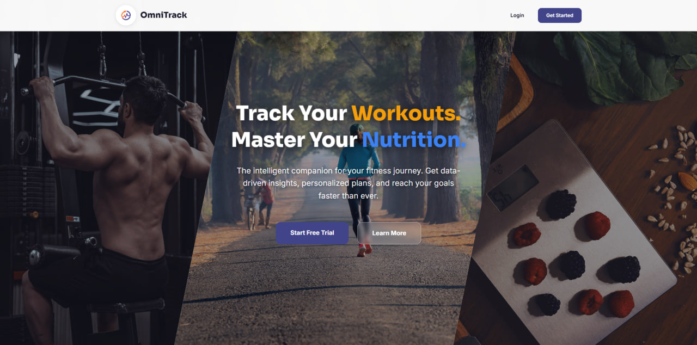
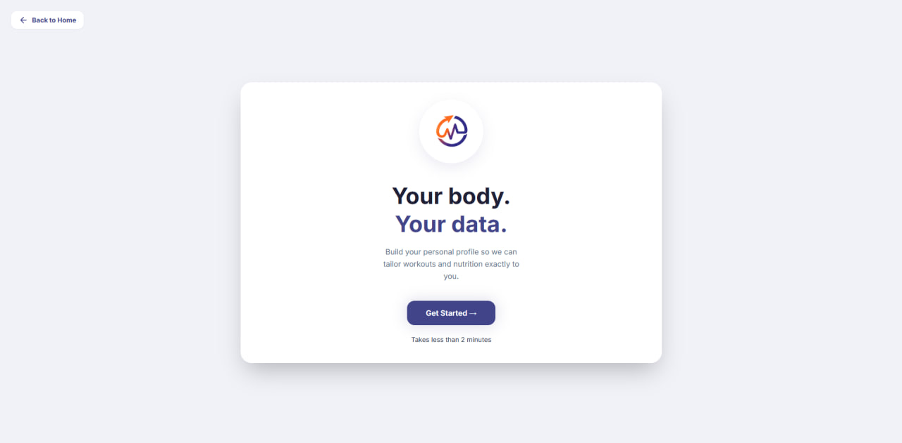
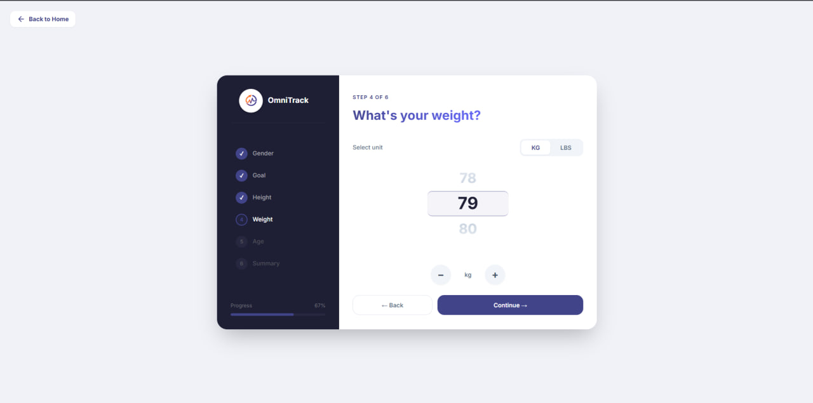
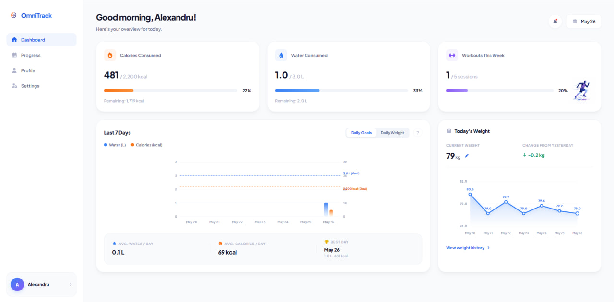

# Workout & Health Tracker

Welcome to the **Workout & Health Tracker** repository! This is a modern, full-stack web application designed to help users log their physical activities, track core health metrics, and manage their wellness journeys with ease and precision.

The application features a beautifully polished responsive user interface built using **React 19**, **Tailwind CSS v4**, and **Framer Motion**, backed by a robust and scalable layered REST API built with **ASP.NET Core** and **C#**.

---

## Project Structure

The codebase is organized into clean, modular workspaces:

```text
├── /front      → React + TypeScript (UI, routing, API calls)
└── /back       → ASP.NET Core + C# (REST API, authentication)
```

- **`/front`**: Built with React, TypeScript, and Vite. Handles user interaction, responsive page routing with React Router DOM, state synchronization, smooth transition animations, and API requests via Axios.
- **`/back`**: Multi-layered ASP.NET Core Web API structured around Clean Architecture principles. It includes domain layers, data access, business logic, and API endpoints secured with token-based authentication.

---

## Preview

### Landing Page


### Dashboard & Onboarding Flow
Here is a preview of the onboarding flow and the main user dashboard:

| Welcome Onboarding | Onboarding Weight Step | User Dashboard |
| :---: | :---: | :---: |
|  |  |  |

---

## Tech Stack & Architecture

### Frontend (`/front`)
* **Core Library:** React 19 (Component-based architecture)
* **Build System:** Vite 7 (Ultra-fast Hot Module Replacement)
* **Styling:** Tailwind CSS v4 + PostCSS (Highly custom, premium modern styling system)
* **Animations:** Framer Motion (Fluid transitions and micro-animations)
* **Routing:** React Router DOM v7 (Clean nested routes and navigation)
* **API Client:** Axios (Configured with request/response interceptors for robust communication)

### Backend (`/back`)
* **Core Framework:** ASP.NET Core (RESTful Web API design)
* **Language:** C#
* **Architecture:** 4-Layered Clean Architecture
  * **`HealthMonitor.Domain`**: Core enterprise business models and entities.
  * **`HealthMonitor.DataAccesLayer`**: Persistence, repositories, and direct database contexts.
  * **`HealthMonitor.BusinessLayer`**: Core business flows, validations, services, and processing rules.
  * **`HealthMonitor.Api`**: API controllers, endpoints, and middleware.
* **Containers:** Docker Compose configuration included for seamless development orchestration.

---

## Authors

This application is a collaborative effort developed by our dedicated team:

- **Alexandru Gherciu**
- **Daniel Chițanu**
- **Jumiga Maximilian**

---

*Developed for TWeb Web Applications Development course.*
